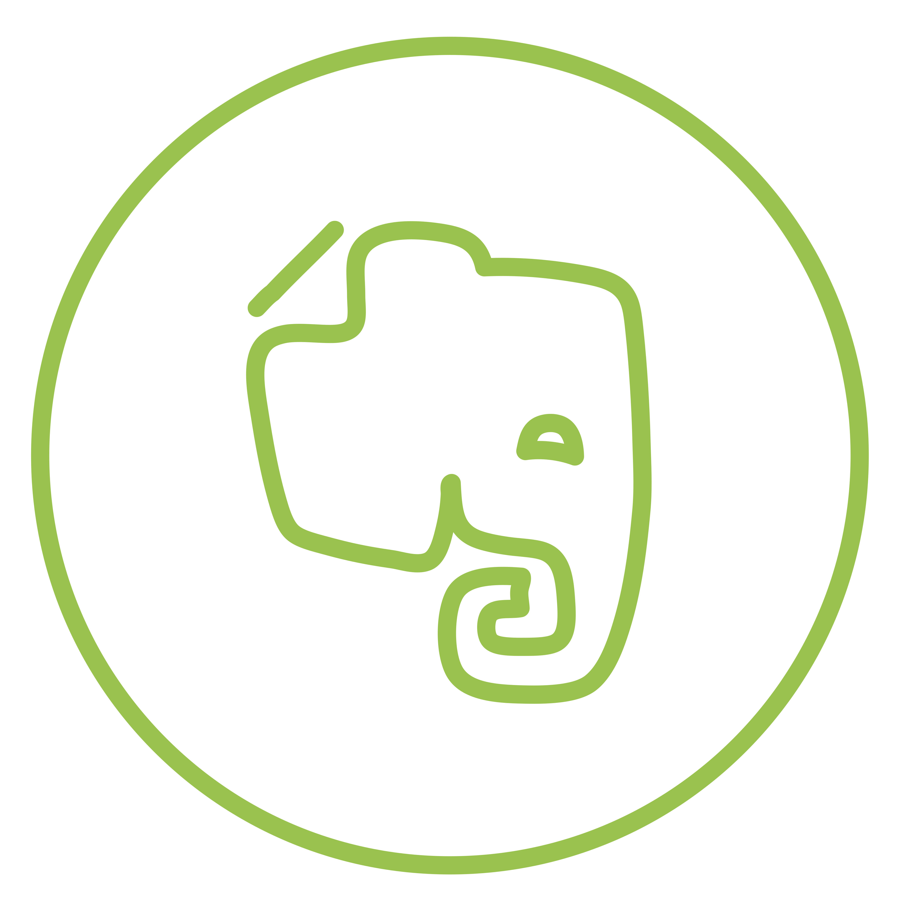

# Planner

<p align="center">

</p>
<p align="center">
Get more done with Keep. 
<br />
Manage, capture and edit your daily notes.
</p>

# Introduction

Keep is a full stack web application built in MERN stack to keep a track of your activity every month, every day, every hour.

-   **Runtime used in backend** - [Node.js](https://nodejs.org/)
-   **Frontend framework** - [React JS](https://reactjs.org/)
-   **CSS preprocessor** - [SASS](https://sass-lang.com/)
-   **Backend framework** - [Express](https://expressjs.com/)

# Themes

Keeper's color palette has been synchronized and carefully chosen to provide the best user experince.

The app will switch to dark mode automatically after 8:00 PM and will switch back to light mode at 8:00 AM.

Though the user can still switch between different modes as per their convenience.

To switch between different modes, click on theme icon in the header.

# Development

To clone copy the following command in your terminal and start development.

```sh
git clone https://github.com/akshatmittal61/keep.git
```

cd into the directory

```sh
cd keep
```

Install all the dependencies
```sh
npm i
```

Run the project in development mode

```sh
npm run react
```

Run the backend server

```sh
npm run server
```

Open [http://localhost:3000](http://localhost:3000) to view it in the browser.

# Author

[Akshat Mittal](https://akshatmittal61.github.io/portfolio)

## References and Libraries Used

-   [Google Keep](https://keep.google.com)
-   [Axios](https://axios-http.com/)
